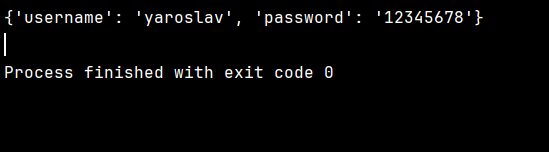

# Практична робота 18
## Завдання 1.
Створіть функцію calculate_average(*args), яка приймає довільну кількість чисел та повертає їх середнє арифметичне. Якщо аргументи не передані, функція повинна повертати 0.
Приклад використання фунції: 
```
print(calculate_average(2, 4, 6))   Вивід: 4.0
print(calculate_average(1, 3, 5, 7, 9))   Вивід: 5.0
print(calculate_average())   Вивід: 0
```

### Код
```python
def calculate_average(*args):
    list = []
    for number in args:
        list.append(number)
    if len(list) == 0:
        return 0
    average_value = sum(list) / len(list)
    return average_value


if __name__ == '__main__':
    print(calculate_average(2, 4, 6))
    print(calculate_average(1, 3, 5, 7, 9))
    print(calculate_average())
```
### Консоль

## Завдання 2.
Створіть функцію greet_students(greeting, *names), яка приймає параметр greeting(привітання) та довільну кількість імен студентів. Функція повинна вивести привітання для кожного студента. Якщо імена не передані, функція повинна вивести повідомлення "Немає студентів для привітання".
### Код
```python
def greet_students(greeting, *names):
    if not names:
        print(f"Немає студентів для привітання")
    else:
        for name in names:
            print(f"{greeting}, {name}!")

if __name__ == "__main__":
    greet_students("Привіт")
    greet_students("Привіт", "Олег")
    greet_students("Привіт", "Юля", "Олег", "Аліна")
```
### Консоль

## Завдання 3.
Створіть функцію print_student_info(**kwargs), яка приймає довільну кількість іменованих параметрів з інформацією про студента та виводить її у форматованому вигляді. Виводиться в форматі “Ключ : Значення”, де ключ повинен бути завжди з великої літери. Функція повинна обробляти випадок відсутності аргументів.
### Код
```python
def print_student_info(**kwargs):
  if not kwargs:
      print("Немає інформації про студента")
  else:
      for key, value in kwargs.items():
          print(f"{key.capitalize()}: {value}")

if __name__ == '__main__':
        print_student_info(name="Ярослав", age=17, course=3, group="КІПЗс-22-3")
        print_student_info()
```
### Консоль

## Завдання 4.
Створіть функцію create_student_report(*students, **subjects), яка приймає імена студентів через *args та їх оцінки через **kwargs. Функція повинна створити звіт про успішність, виводячи спочатку список студентів, а потім предмети з оцінками. Функція повинна обробляти випадки, коли немає студентів або немає оцінок.
create_student_report("Іван", "Марія", math=12, physics=11, history=10)
```
Звіт успішності:
Student: Іван
Student: Марія
Marks:
Math: 12
Physics: 11
History: 10
```
### Код
```python
def create_student_report(*students, **subjects):
    if not students:
        print("Немає студентів")
    else:
        print("Звіт успішності:")
        for student in students:
            print(f"Student: {student}")
    if not subjects:
        print("Немає предметів і оцінок")
    else:
        print("Предмети та оцінки:")
        for subject, grade in subjects.items():
            print(f"{subject.capitalize()}: {grade}")

if __name__ == "__main__":
    create_student_report("Yaroslav", "Yaroslav-2", python=12, java=2, rust=0)
```
### Консоль

