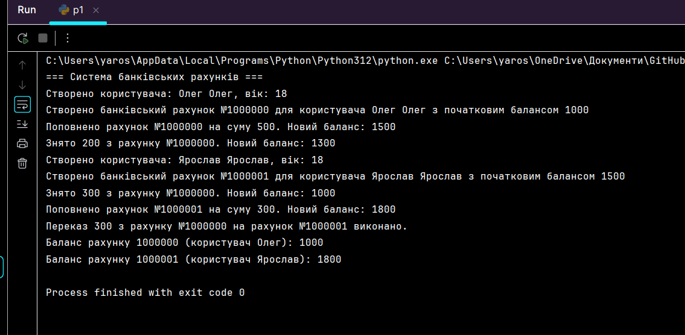
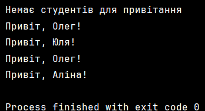
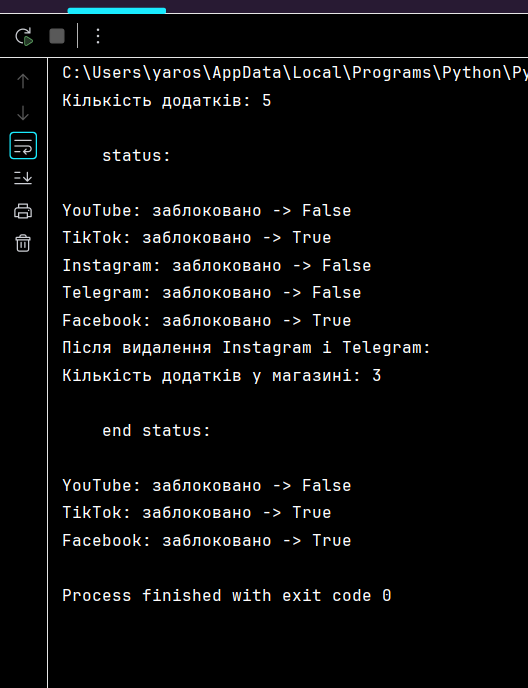

# basics-of-programming-Python

# Завдання 1.
Оголосіть клас CardCheck для перевірки коректності інформації на
пластикових картках. Цей клас повинен мати такі методи:
● check_card_number(card_number) - перевіряє рядок із номером
картки та повертає булеве значення True, якщо номер у правильному
форматі, і False - у протилежному випадку. Формат номера такий:
XXXX-XXXX-XXXX-XXXX-XXXX, де X - будь-яка цифра (від 0 до
9).
● check_name(name) - перевіряє рядок name з ім'ям користувача
картки. Повертає булеве значення True, якщо ім'я записано вірно, і
False - в іншому випадку.
Подумайте, як правильно оголосити методи check_card_number та
check_name (декораторами @classmethod та @staticmethod).
Формат імені: два слова (ім'я та прізвище) через пробіл, записані
великими символами. Наприклад, YURIY RYBAK.
Передбачається використовувати клас CardCheck таким чином (ці
рядки в програмі не писати):
is_number = CardCheck.check_card_number(‘4321-8765-9012-4321’)
is_name = CardCheck.check_name(‘YURIY RYBAK’)

# Код: [p1.py](p1.py)
# Консоль: 
# Завдання 2.
Оголосіть у програмі клас Video з двома методами:
● create(self, name) - для задання імені name поточного відео (метод
зберігає ім'я name у локальному атрибуті name об'єкта класу Video);
● play(self) - для відтворення відео (метод виводить на екран рядок
"відтворення відео <name>").
Оголосіть ще один клас з іменем YouTube, у якому оголосіть два
методи (з декоратором @classmethod):
● add_video(cls, video) - для додавання нового відео (метод поміщає
об'єкт video класу Video у список);
● play(cls, video_index) - для програвання відео зі списку за вказаним
індексом (індексація з нуля!).

тут cls - посилання на клас YouTube).
І список (теж всередині класу YouTube):
videos - для зберігання доданих об'єктів класу Video(спочатку список
порожній).
Метод play() класу YouTube повинен звертатися до об'єкта класу
Video за індексом списку videos і, потім, викликати метод play() класу
Video.
Методи add_video і play викликайте безпосередньо з класу YouTube.
Створювати екземпляр цього класу не потрібно.
Створіть два об'єкти video1 і video2 класу Video, потім, через метод
create() передайте їм імена "Основи програмування" і "Вивчення Python за
45 хвилин!". Після цього за допомогою методу add_video класу YouTube,
додайте в нього ці два відео і відтворіть (за допомогою методу play класу
YouTube) спочатку перше, а потім, друге відео.

# Код: [p2.py](p2.py)
# Консоль: 
# Завдання 3.
Оголосіть клас AppStore - інтернет-магазин додатків для пристроїв
під iOS. У цьому класі мають бути реалізовані такі методи:
● add_application(self, app) - додавання нового додатка app у магазин;
● remove_application(self, app) - видалення додатка app з магазину;
● block_application(self, app) - блокування застосунку app (встановлює
локальну властивість blocked об'єкта app у значення True);
● total_apps(self) - повертає загальну кількість застосунків у магазині.
Клас AppStore передбачається використовувати таким чином (ці
рядки в програмі не писати):

store = AppStore()
app_youtube = Application(‘Youtube’)
store.add_application(app_youtube)
store.remove_application(app_youtube)

Тут Application - клас, що описує додаток, який додається, із
зазначеним ім'ям. Кожен об'єкт класу Application повинен містити
локальні властивості:
● name - найменування додатка (рядок);
● blocked - булеве значення (True - застосунок заблоковано; False - не
заблоковано, спочатку False).
Як зберігати список додатків в об'єктах класу AppStore вирішите самі.

# Код: [p3.py](p3.py)
# Консоль: